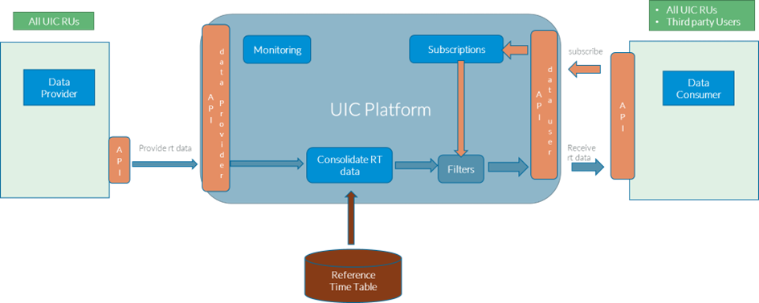

# Architecture

## Design Decisions

### REST API vs. QUEUES

The delivery of updates service runs could be implemented using a data exchange via queues or using a REST API webhook 

- Queues are usually non-interoperable between different implementers and thus multiple queue implementations would have been needed in the platform implementation. 
- The open standard for queues (AsyncAPI) is not widely adopted and products implementing it are rare.
- Webhooks are an established easy to use technology already in use in the ETCD platform for ticket control.
- Webhooks do not require a specific product to be used.

**Desicion**:

It was decided to implemnt the data exchange via a webhook.
   
### Full service run data deliveries vs. Delta Updates

Updates on a serviceRun could be provided by sending the entire service rund data or by sending the changed parts only.

**Sending the entire service run data:**

  - Allows the platform to have a more robust logik to identify the serviceRunas there are not serviceRun ids common to all involved providers. Thus the platform needs to identify the serviceRun in time-table data and amoung different providers in case of trains provided by multiple carriers (e.g. cross border trains).

  - Provides a robust exchange in case of load peaks with lost data as the entire data will provide a consistent view of the service run from the perspective of the provider.

**Sending the changed parts only:**

- Requires additional logik in the API to distinguish missing and deleted data parts.

- Requires a consistent view ofthe provided service run between each provider and the plattform to reconstructvthe entire service run on the platform side before merging the views of different providers for one train.

- Will reduce the data volume transfered but not the number of messages exchanged. Thus the performance gain on the network is very limited.

- The baseline for sending changes is also not uniformly defined.

**Desicion:**

It was decided to exchage alsways the entire service run data.

### Require an initial service run delivery a day before the service run starts

The baseline for reporting changes in real time data on a service run is not uniformly defined in provider systems. Some might report canges with respect to the infrsastucture plan of the previous das, some on an internally used consumer timetable and some on the latest delivery to UIC MERITS. 

As the platform uses the latest consolidated MERITS time table as baseline there might be some changes missing if the provider internally uses another baseline.

**Desicion:**

It was decided that the provider must send a complete servicerun a reasonable amount of time before the service run starts.

### Provide estimated times vs. providing delays

Changes from the planned arrival and departure times could be delivered as delays compared to the planned times or as estimated times independent from the planned time.

**Providing delays:**

A provider would deliver delays with respect to a planning that he assumes appropriate. This might differ between providers and between the provider and the MERITS plan on the platform. 

**Providing estimated times:**

Estimated times have a defined meaning independent from the source of the planned times.

**Desicion:**

It was decided that estimated times are provided. How and whether these are indicated to the traveler as delays is up to the data consumer.

## Architecture Overview

On high level the architecture is simple. A Data Provider will deliver real-time according to the standard API format of the platform [see Bibliography] . The API is developed with the information in mind to cover most of the use cases related to international trains. It is expected that an RU as Data Provider can deliver all essential information. Other Data Providers are allowed to send data as long as they fill the essential information in the API.
The platform will make consolidated Service Runs from the input of the Data Providers. The platform provides a push and a pull service to give Data Consumers the possibility to retrieve data.
The timetable reference plan serves as input for the platform to create Service Runs with consistent planned times.

`

## APIs

### Data Provider API

REST OPEN API

The technical specification is provided as open api specification version 3.1 (yml format). 	
One endpoint to send real-time data on a serviceRun is provided:  POST /service/run/
-	The platform service is idempotent.
-	Authentication is implemented according to OAUTH 2.0.
-	Communication errors are handled by the Data Provider. It is up to the Data Provider to ensure that in case of communication errors retries are implemented.

#### Data Consumer API

REST OPEN API

The technical specification is provided as open API specification version 3.1 (yml format). 	
Data export is implemented as a webhook. The consumer needs to register an endpoint in a subscription where he can receive notifications on new or updated Service Runs. The provider will send notifications to the registered endpoints for new or updated Service Runs. The platform subscription service allows to define the filter options for receiving data.
The platform will provide endpoints to add, modify and delete subscriptions to consume data and to receive a list of the registered end points of a company.
-	PUT /subscriptions/ …
-	PATCH / subscriptions/{subscriptionId} …
-	DELETE / subscriptions/{subscriptionId}
-	GET / subscriptions/company={companyId}
The platform must ensure to keep the services running. To do so the platform is allowed to degrade the services for users not compliant with agreements or expected behaviour as:
-	The platform might reject subscriptions if the number of registrations goes beyond the agreed limit.
-	The platform might suspend a registered end point in case it is not responding according to the required service level.
-	The platform will implement a retry mechanism in case of communication errors when providing notifications. The platform might abandon the delivery in case the communication errors on the end point provided by the Data Consumer goes beyond the usual limits.
The platform will provide an endpoint to retrieve the Service Run using the id provided in the notification. The handling of communication errors is up to the Data Consumer.
-	GET /serviceRuns {serviceRunId}             			- retrieve one service
-	POST /serviceRuns/get {serviceRunIds}     			- retrieve multiple services
The platform will provide an endpoint to search for services.
-	POST /serviceRuns/search {search parameters}
The platform will provide a service to create or update platform service settings
-	POST /serviceRun {serviceRun}

