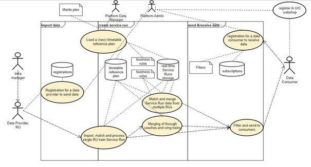
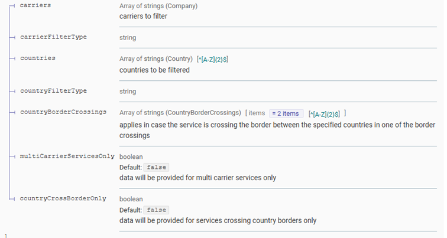

# Use Cases

`

## Use Cases for a Data Consumers

### subscribe a webhook

In order to retrieve data o his webhook(s) a data consumer needs to subscribe the webhook. The substription includes the url and credentials to allow the platform to send real time data to the webhook and defines filter criteria to restrict the data to be sent.

The data comsumer can provide a filter in the subscription to limit the notifications received:

- carrierFilterType:
  -	**INCLUDE**: selects services where ANY of the specified carriers serve any part of the service.
  -	**EXCLUSIVE**: selects services where ANY of the specified carriers serve all parts of the service. In this case, services run by multiple carriers are not included in the selection.
  -	**EXCLUDE**: selects services where NONE of the specified companies are the carrier for any part of the service.
- countryFilterType:
  -	**INCLUDE**: select services where ANY of these countries is part of the route of the service. In this case, international services running at least partly in any of those countries are included in the selection.
  -	**EXCLUSIVE**: select services where the route of the service is run completely inside ANY of these countries. In this case, international services across the provided countries are not included in the selection.
  -	**EXCLUDE**: select services where NONE of the specified countries are any part of the service.

`

### manage subscriptions

A data consumer can manage its subscriptions via the API:

- Add a subscription
-	Change a subscription
-	Delete a subscription
-	Get a list of all subscriptions

### retrieve real time data using the web hook

If there is real time data avialable that meet the filtercriteria of the data consumers description the data consumer will receive a notification on his webhook registered viy the subscription. The notification includes the id of the service run that has an update.

The data consumer needs to retrieve the service run via the id provided in the notification.

### retrieve real time data using the search for service runs

The API provides a search for service runs. In order to retrieve the correct service run one of the involved carriers and the country need to be specified.

Using the search might be more efficient compared to retrieving all service runs via a web hook in case the number of requests is limited compared to the amount of updates from all service runs.

## Use Cases for a Data Providers

### Initial data delivery independent from service run changes

A data provider must provide each service run a reasonable time before the start of the service run (72 to 24 hours before the start) in order to have a synchronized baseline with the time table data on the platform. 

### Providing updates on service runs

In case of a change on  the service run the data provider must send the entire service run including the changes.

### Retrieving service runs

A data provider should also retrieve service run data on trains including other carriers in order to take incoming delays into account. This follows the use case for data consumers. The subscription filter can be defined to provide service runs including additional carriers only.

